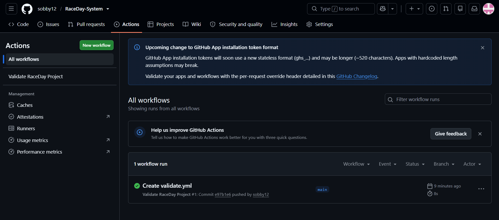

# RaceDay-System

## System Description

RaceDay System is a race and event management system designed to support the management of running, walking and cycling events.

The system allows users to register and log in, manage their profiles, view available events and view event details. Participants can enrol in events by selecting a category, manage their enrolments and view their own race results. Organizers can create, update and delete events and categories, view event enrolments, and record and update participant results.

The database is implemented using Microsoft SQL Server and is called `RaceDayDB`. The database contains six main entities:

- Roles
- Users
- Events
- Categories
- EventEnrollments
- Results

The SQL database includes primary keys, foreign keys, unique constraints and check constraints to maintain data integrity. It also contains sample data and verification queries for testing the database in SQL Server Management Studio (SSMS).

## Database Design

The database is designed to support the main relationships in the RaceDay System.

- Roles are assigned to users.
- Organizers can manage multiple events.
- Events can contain multiple race categories.
- Participants can enrol in events and select a category.
- Each enrolment can have one race result.
- Foreign keys are used to maintain relationships between the tables.
- Unique and check constraints are used to help maintain valid data.
  
## User Roles

### Organizer

The Organizer is responsible for managing race events and their categories. An Organizer can:

- Create new events
- Update existing events
- Delete events
- Create event categories
- Update event categories
- Delete event categories
- View participants enrolled in an event
- Record participant results
- Update existing results

The Organizer is also able to register, log in and manage their own user profile.

### Participant

The Participant is a user who takes part in race events. A Participant can:

- Register and log in
- View and update their own profile
- View available events
- View event details
- View event categories
- Enrol in an event by selecting a category
- View their own event enrolments
- Cancel an enrolment
- View their own race results

## API

The API endpoint plan defines endpoints for authentication, user profiles, events, categories, enrolments and results.

Examples include:

- `POST /api/auth/register` - Register a new user
- `POST /api/auth/login` - Log in a registered user
- `GET /api/events` - View available events
- `POST /api/events` - Create an event
- `GET /api/events/{id}` - View a specific event
- `POST /api/events/{eventId}/enrolments` - Enrol in an event
- `GET /api/results/me` - View the logged-in participant's results

The complete endpoint plan is available in the `/docs` folder.

### API Role Permissions

The API uses role-based access to separate Organizer and Participant actions.

- **Organizer:** Can create, update and delete events and categories, view event enrolments, and record or update participant results.
- **Participant:** Can view events and categories, enrol in events, manage their own enrolments, and view their own results.
- **Both roles:** Can register, log in and manage their own user profile.

## Database

The RaceDay database is implemented using Microsoft SQL Server.

The SQL script:

1. Creates the `RaceDayDB` database.
2. Creates the six database tables.
3. Defines primary keys, foreign keys and constraints.
4. Inserts sample roles, users, events, categories, enrolments and results.
5. Provides verification queries for testing the database in SSMS.

### Data Integrity

The database uses constraints to help keep the data valid and consistent.

- Primary keys uniquely identify records.
- Foreign keys maintain relationships between related tables.
- Unique constraints prevent duplicate role names, user emails and category names within an event.
- Check constraints validate values such as event type, distance, entry fee, participant limits and result status.
- A unique constraint prevents a participant from registering for the same event more than once.

## Technologies

The RaceDay System Part 1 planning and database work uses the following technologies:

- **Microsoft SQL Server** — Database management system used for RaceDayDB.
- **SQL Server Management Studio (SSMS)** — Used to execute and verify the SQL database script.
- **GitHub** — Used for source control and project documentation.
- **GitHub Actions** — Used to validate the required project structure and files.
- **draw.io** — Used to create the Entity Relationship Diagram.

## Project Structure

The repository is organised to keep the project documentation and validation workflow easy to locate.

- `/docs` — Contains the ERD, API endpoint plan, SQL database script and GitHub Actions evidence.
- `/.github/workflows` — Contains the GitHub Actions validation workflow.
- `README.md` — Provides an overview of the RaceDay System, user roles, API, database and project documentation.

  ## Security Considerations

The RaceDay System separates access between the Organizer and Participant roles.

- Organizers are responsible for managing events, categories and participant results.
- Participants can manage their own enrolments and view their own results.
- The API endpoint plan identifies which role is permitted to access each operation.
- User email addresses are unique in the database to help prevent duplicate accounts.

## Testing

The SQL database script includes verification queries that can be executed in SQL Server Management Studio (SSMS).

These queries are used to confirm that:

- The required tables were created successfully.
- Sample roles and users were inserted.
- Events and categories were inserted correctly.
- Event enrolments were created correctly.
- Participant results were inserted correctly.
- The relationships between the database tables are working as expected.

## Future Development

The planning completed in Part 1 provides the foundation for the next stage of the RaceDay System.

Future development can include implementing the planned API endpoints, connecting the API to the RaceDayDB database, implementing authentication and role-based authorization, and building the functionality for event enrolments and race results.

## Project Documentation

The planning documents are available in the `/docs` folder:

- [ERD](docs/RaceDay_ERD.drawio.png)
- [Endpoint Plan](docs/RaceDay.docx)
- [SQL Database Script](docs/RaceDay_Database_Final.sql)
  
### Documentation Purpose

- **ERD:** Shows the database entities and their relationships.
- **Endpoint Plan:** Defines the API operations and which role can access each operation.
- **SQL Database Script:** Creates the database structure, inserts sample data and provides verification queries for SSMS.
- **GitHub Actions Screenshot:** Provides evidence that the repository validation workflow completed successfully.

## CI/CD

GitHub Actions is used to validate the required repository structure and documentation.

A workflow will check that the required `/docs` folder and project files are present.

### Successful Build

## Project Video

An unlisted YouTube video will be provided showing the planning documents, ERD decisions, endpoint plan and SQL script being executed in SQL Server Management Studio.

[Watch the RaceDay System project walkthrough on YouTube](https://youtu.be/IO0UysTTx9Q)
